# சொல்-ஒலி-படம்

தமிழ் கற்க எளிதான வழி.

## 01. விளையாட்டு

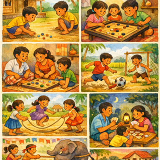

## 02. கால

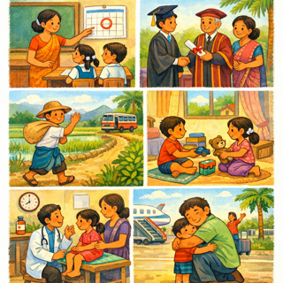

## 03. தூக்கம்

## 04. பல

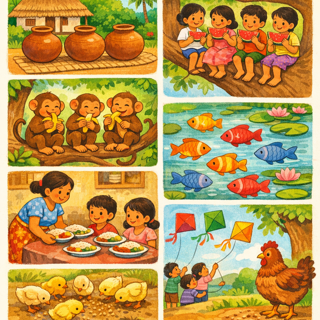

## 05. அளவுகோல்

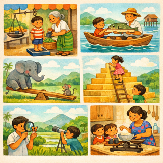

## 06. பள்ளி

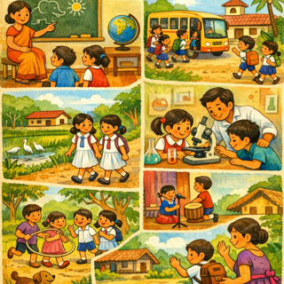

## 07. ஓடை

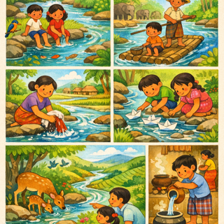

## 08. மாநில

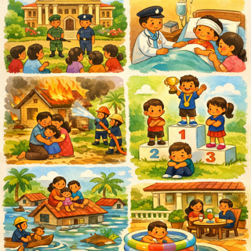

## 09. சிப்பாய்

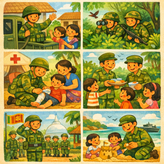

## 10. கண்டுபிடிக்க

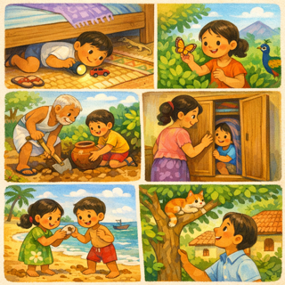

## 11. புதியது

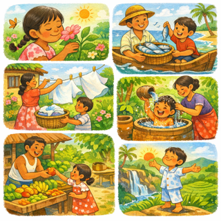

## 12. சூடான

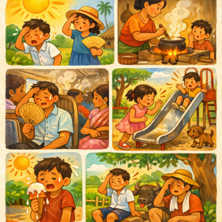

## 13. பொருத்தம்

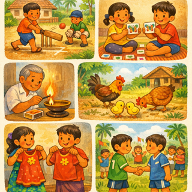

## 14. வடிவமைப்பு

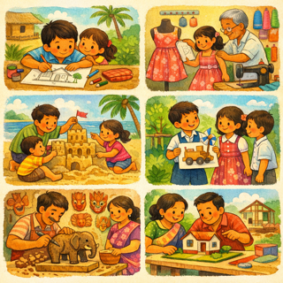

## 15. குரல்

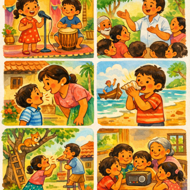

## 16. உடற்பயிற்சி

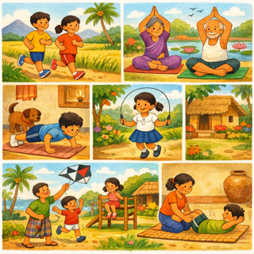

## 17. பூமி

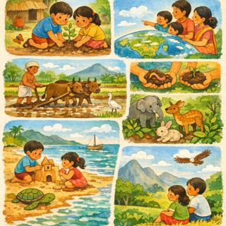

## 18. சிறுவன்

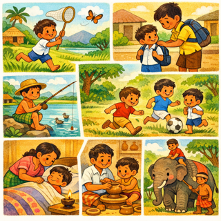

## 19. கற்றுக்கொள்

## 20. தள்ளு

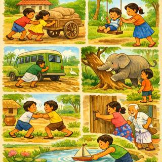

## 21. வாரம்

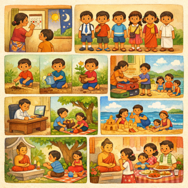
