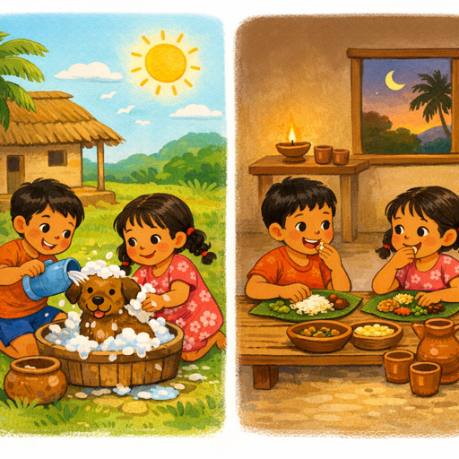
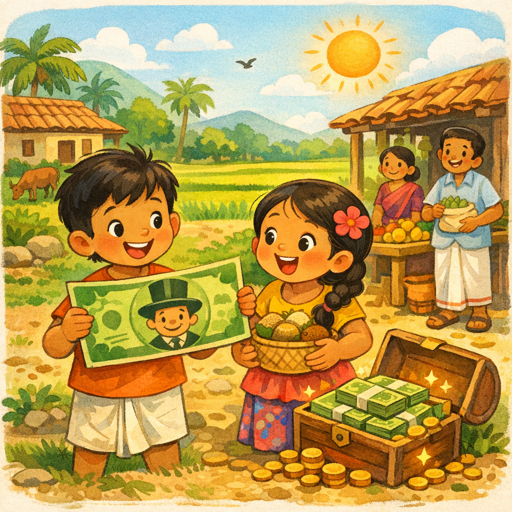
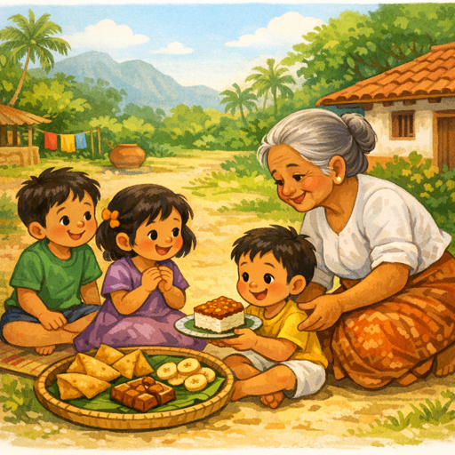
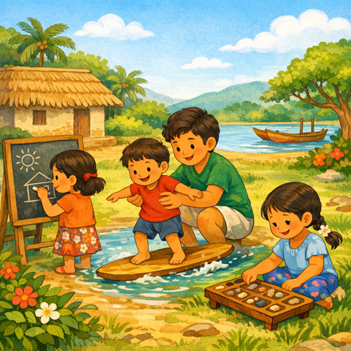
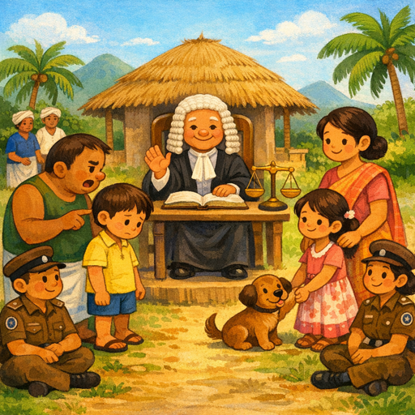
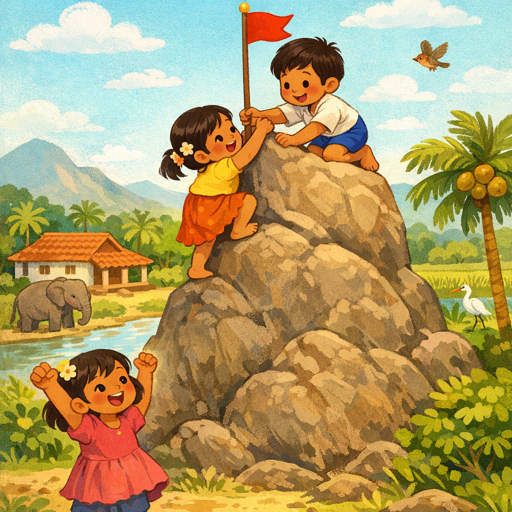

# சொல்-ஒலி-படம்

தமிழ் கற்க எளிதான வழி.

## 01. பிறகு

## 02. மாநில

## 03. முழுமையான

## 04. டாலர்

## 05. குறிப்பாக

## 06. பலகை

## 07. மீண்டும்

## 08. சட்டம்

## 09. உங்கள்

## 10. சாத்தியம்

