# சொல்-ஒலி-படம்

தமிழ் கற்க எளிதான வழி.

## 01. பணக்காரர்

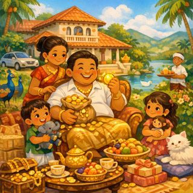

## 02. விண்வெளி

## 03. ஓட்டம்

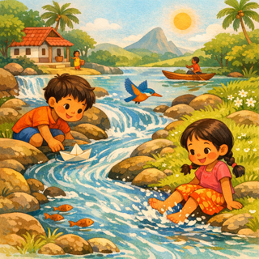

## 04. எங்கள்

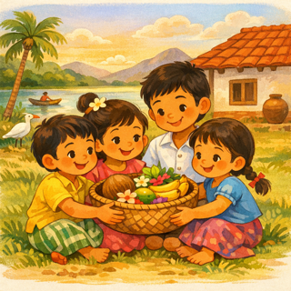

## 05. உலோகம்

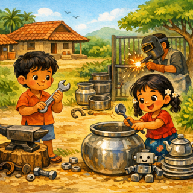

## 06. தற்போதைய

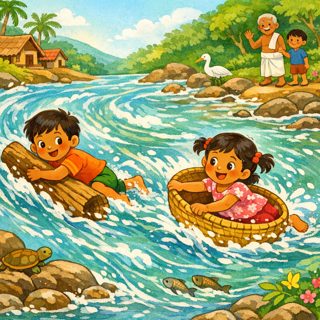

## 07. மையம்

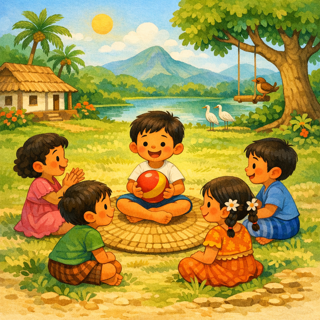

## 08. குறிப்பாக

## 09. போதும்

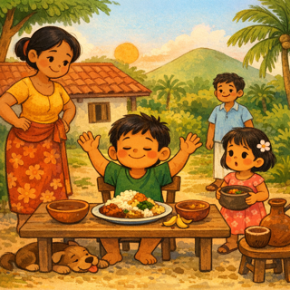

## 10. தெரிந்தது

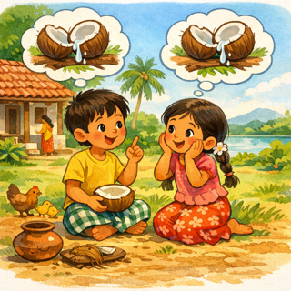

## 11. மக்கள்

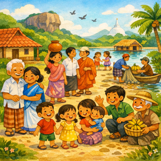

## 12. பாதுகாக்க

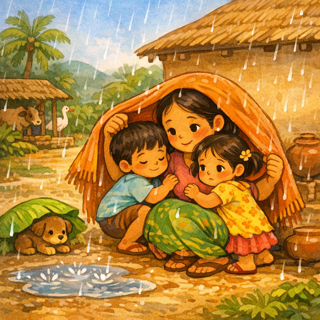

## 13. செயல்முறை

## 14. எழுது

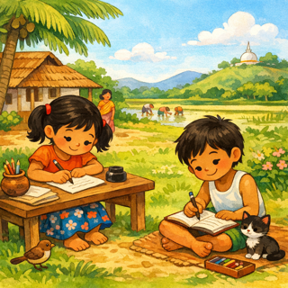

## 15. உலகம்

