# சொல்-ஒலி-படம்

தமிழ் கற்க எளிதான வழி.

## 01. சரி

## 02. படித்தேன்

## 03. பயன்படுத்த

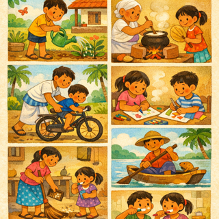

## 04. புதிய

## 05. கொடுக்க

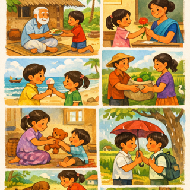

## 06. கற்பிக்கின்றன

## 07. நினைக்கிறார்கள்

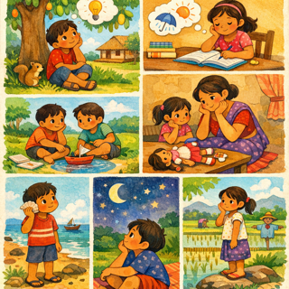

## 08. விற்க

## 09. பார்க்க

## 10. தொடங்கு

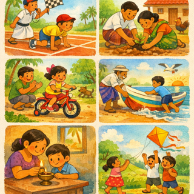

## 11. உட்காருங்கள்

## 12. பயம்

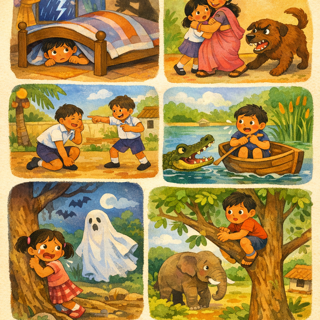

## 13. வேகமாக

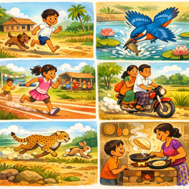

## 14. உண்மை

## 15. உணவு

## 16. திறந்த

## 17. கேட்க

## 18. உயர்

## 19. வாருங்கள்

## 20. மூடப்பட்டது

## 21. அழுக்கு

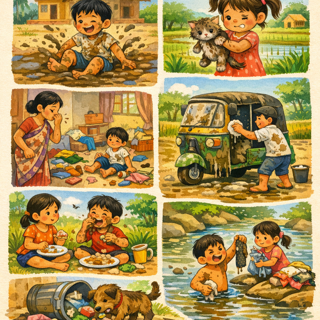

## 22. நாள்

## 23. பெரிய

## 24. வைக்க

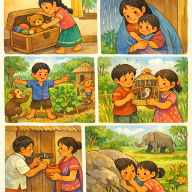

## 25. தெரியும்

## 26. வாழ்க்கை

## 27. விளையாடு

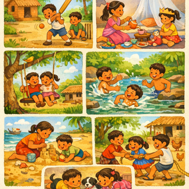

## 28. நபர்

## 29. சக்தி

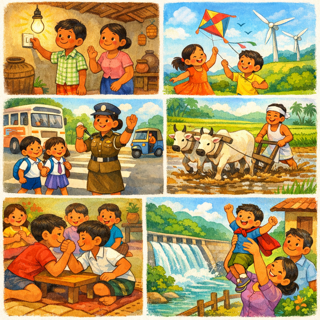

## 30. நடக்க

## 31. வழி

## 32. வேலை

## 33. வார்த்தை

## 34. பெண்

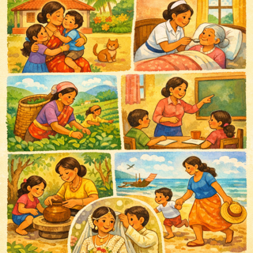
