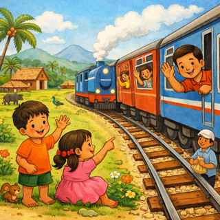
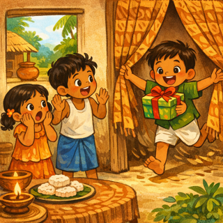
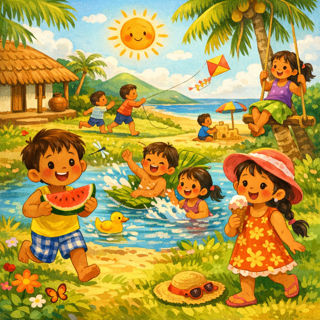
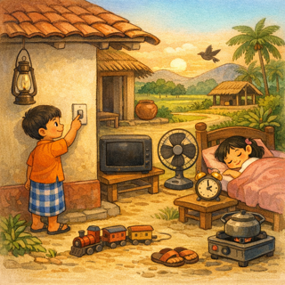

# சொல்-ஒலி-படம்

தமிழ் கற்க எளிதான வழி.

## 01. பணக்காரர்

## 02. ரயில்

## 03. விண்வெளி

## 04. ஆச்சரியம்

## 05. கோடை

## 06. ஓட்டம்

## 07. ஆஃப்

## 08. எங்கள்

## 09. உலோகம்

## 10. தற்போதைய

## 11. உருவாக்க

## 12. மையம்

## 13. குறிப்பாக

## 14. போதும்

## 15. தெரிந்தது

## 16. மக்கள்

## 17. பாதுகாக்க

## 18. செயல்முறை

## 19. எழுது

## 20. உலகம்

